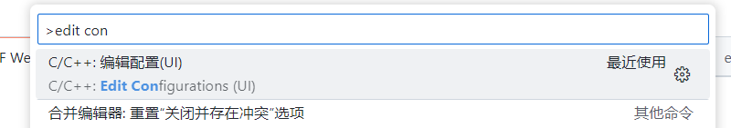
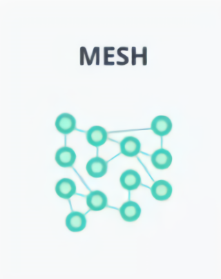
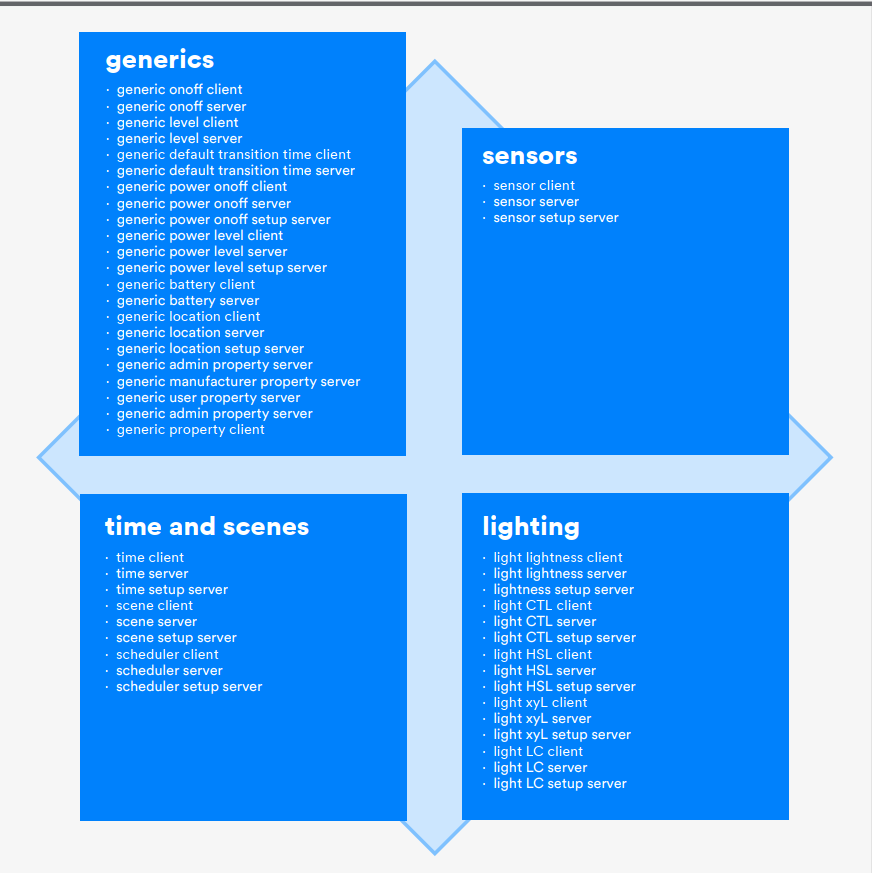

## 0. 关于本文

​	笔者最近正在做到一个项目是关于BLE Mesh网络中各个节点(node)之间的通信的，这是笔者从没接触过的方向，目前项目也在进行中，本文主要是记录一些踩坑过程、整理掌握的知识，同时如果能对跟我有相同问题的人产生些许帮助就再好不过了。本文仅在应用层面以及笔者应用到的部分讨论，不过多涉及底层，以及其他未使用的特性，因此如有错误或理解不到位的地方，恳请指正、共同学习。

​	本项目中硬件是使用的是ESP32-wroom，基于乐鑫官方的[ESP-IDF](https://docs.espressif.com/projects/esp-idf/zh_CN/v5.1/esp32/index.html)开发，笔者选择的开发环境则是使用vscode+ESP-IDF插件，具体环境配置方法这里就不再赘述了，网上由很多教程，这里提供官方教程供作参考：[vscode-esp-idf-extension install](https://github.com/espressif/vscode-esp-idf-extension/blob/master/docs/tutorial/install.md)

​	这里需要补充一点是，在配置完成后当随意打开一个实例工程后，可能不会自动生成`.vscode/c_cpp_properties.json`文件，导致语句跳转等功能不可用，在命令栏中找到`c/c++`插件的这个命令执行即可生成上述文件；但是此时还会提示头文件缺失，这时只需要先编译一边工程，然后再在`c_cpp_properties.json`中加入`"compileCommands": "${workspaceFolder}/build/compile_commands.json"`即可。



```json
//	笔者项目中目前完整的c_cpp_properties.json文件内容

{
    "configurations": [
        {
            "name": "Win32",
            "includePath": [
                "${workspaceFolder}/**"
            ],
            "defines": [
                "_DEBUG",
                "UNICODE",
                "_UNICODE"
            ],
            "cStandard": "c17",
            "cppStandard": "gnu++14",
            "intelliSenseMode": "windows-gcc-x64",
            "compileCommands": "${workspaceFolder}/build/compile_commands.json"
        }
    ],
    "version": 4
}
```


## 1. 关于BLE Mesh

​	BLE Mesh是指由低功耗蓝牙设备(**BLE**)组成的Mesh网络，并不算是一种新的通信方式，同理，`Wifi Mesh`也是存在的，乐鑫在ESP-IDF中也实现了相关功能，感兴趣的读者请自行移步乐鑫官方查阅，这里不做过多介绍。

​	BLE Mesh是一个网状拓扑结构，相邻的节点都相互连接，可以相互通信，其结果就是可以形成一个范围巨大的通信网，最终可以兼具覆盖范围大以及功耗较低的好处。

​	它是一种采用泛洪(**flooding**)协议的技术，使用订阅/发布(**Publish–subscribe**)信息传递方式。

## 2. BLE Mesh组成

​	Mesh网络中由一个个节点(**node**)组成，可以理解为网络中的一个个设备，同时节点又由若干个元素(**element**)组成，而一个元素又实现1-2个模型(**model**)，但是一般只实现一个模型。Mesh网络中有两种身份，一个是`node`另一个是`provisioner`；而`node`又可以通过使能不同的功能成为不同类型的`node`。

​	以上各个名词是笔者在接触BLE Mesh的第一个门槛，这里先向读者尽量讲解清楚，如果笔者讲解的不够清楚或准确，读者可自行查阅相关资料，文末会附上相关文档资料。

### <1> Node

​	Node是Mesh网络组成的元素，但并不是最小元素，示意图如下，图中绿色实心点即是代表Node，可以理解为基于BLE Mesh网络的智能家居系统中的一个个智能设备。node通过使能不同的功能而成为的不同节点这里暂且不谈，只简单介绍一下 **provisioner**，它在整个网络中是类似门卫的存在，负责未入网的节点的入网，这里相关名词只是使用了尽可能简单的解释，具体内容后续文章会进行讲解。



### <2>Element

​	Node中一般会包含一个主要元素(**Element**)和若干次要元素，元素可以理解为一个设备包含的独立子设备，例如一个有照明功能的风扇，一般会抽象出两个元素，一个负责照明，另一个则是负责风扇。

​	由于每个元素在Mesh网络中都会被分配一个唯一的单播地址(**unicast address**)，为了方便计算地址，每个节点中的**主要元素**则会负责计算节点中的所有元素的地址，也因此，主要元素可能会实现两个模型(**model**)，一个负责配置，另一个则是向其他次要元素中的模型，负责具体的应用功能。

### <3>Model

​	上面Element已经将功能抽象出来了，那么具体实现则是由Model实现。例如上面的风扇和照明灯，一个模型实现风扇的开关，另一个则是实现灯光的开关。

​	这样解释可能还是有些抽象，但是在进一步解释之前，需要先接收`client-server`模式即“服务端/客户端”模式，有web应用等相关开发经验的读者应该知道，这个模式就是客户端向服务端发送请求，请求服务或者数据，服务端处理客户端发来的请求，然后根据需要决定是否返回给客户端相关数据。BLE Mesh中也采用这种方式。前面说过Mesh中采用订阅发布的消息模式，这里不要跟c/s模式混淆。

​	基于以上，BLE Mesh中的Mode分为两类，即`client`和`server`，client向server请求服务，例如开灯、关灯、开风扇、关风扇，同时也可以请求数据服务，如：获取灯当前的开关状态、风扇的开关状态等，但是这只是Model的区别，并不能用它来区分Node，有的Node中可能既实现了Server Model也实现了Client Model，例如一个温湿度传感器，它向其他设备提供温湿度的数据服务，同时假设当它检测到湿度超过一个阈值时，它会向抽湿机请求抽湿服务，那么这时它又是一个client。

​	目前市面上使用的BLE Mesh是由SIG推出的统一的标准协议，又称为SIG Mesh。BLE Mesh中的模型由SIG Model 和Vender Model两类组成，前者是由SIG提供的，涵盖大部分常用功能的模型，称为SIG Model，后者则是用户根据自身需要，自定义的模型。

​	自定义模型后面有机会再讲，这里以最常用的`onoff model`举例，顾名思义，这个模型适用于仅有 on/off两个属性的功能，例如开关等。就笔者个人理解而言，model就是由若干操作以及状态组成的结构体，以下面的代码为例：

``` c
//	以下均为笔者个人理解，仅供参考，欢迎指正
typedef struct{
    status_t status;			//	记录状态值
    op_set_status_cb_t set_cb;	//	修改status的值
    op_get_status_cb_t get_cb;	//	获取status的值
}model;
```

SIG Model规定若干个操作码 (在实际代码中常表述为`opcode`/`operation_code`) ，每一个操作码对应一个具体的回调函数，那么当一个用户或client从发送开灯消息到灯被打开的流程大概是这样的：

```tex
用户：发送关灯消息(携带操作码、目标地址、源地址等所需信息)			# 用户操作
设备接收到信息：
	ESP-IDF框架：解析出相关信息、模型类型、操作码、值等			# 事先由框架规定好，不需要用户操作
	ESP-IDF框架：找出操作码对应的回调函数并调用。				  # 事先由框架规定好，不需要用户操作
		对应回调函数：执行实现实现好的逻辑，将结构体中的status设置为携带的值(SET)	# 事先由框架规定好，不需要用户操作
	ESp-IDF框架：触发相应的事件								# 事先由框架规定好，不需要用户操作
用户：执行用户实现写好的事件处理的逻辑，这里为控制相关管脚输出高电平，打开灯	#用户操作

```

​	由上面大致流程可知，所谓的Model就是负责记录和管理(操作)相关属性的，而实际硬件操作则需要用户自己根据需要实现。下图是SIG规定的所有SIG Model，这里笔者不再赘述，有需要的读者可自行了解。文章结尾处会附上相关文章。



## 结尾

​	本篇文章简单介绍了BLE Mesh中的各个组成部分，以及相关基本的概念，关于provisioner等相关内容后续再进行讲解。

​	各位读者如果有什么问题欢迎提出，也是对笔者学习成果的建议，如果文中哪里有错误也请一定指出。


部分可供参考文章： 

* [红旭无线 SIG Mesh教程](https://docs.wireless-tech.cn/doc/24/)
* [ESP-IDF BLE Mesh部分](https://docs.espressif.com/projects/esp-idf/zh_CN/v5.1/esp32/api-reference/bluetooth/esp-ble-mesh.html#)
* [csdn博主 流云IoT 相关文章](https://stream.blog.csdn.net/?type=blog)
* SIG官方相关文档

